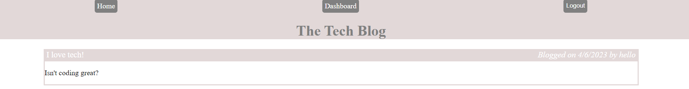

# Tech Blog

## Description
A tech blog with user posts and comments on posts from users.

## Screenshot of Application

## Table of Contents
- [Installation](#Installation)
- [Usage](#Usage)
- [License](#License)
- [Contributing](#Contributing)
- [Tests](#Tests)
- [Questions](#Questions)
## Installation
None required.
## Usage
Navigate to https://tech-blog99.herokuapp.com/. Click on the Login button at the top left of the page. Enter login information, or click the Create New Account link. Once signed in, go to Dashboard to either create a new post or update an existing post. Click on Home to view all posts. To leave a comment, click on a post, type a comment in the input box and click the Submit Comment button. Click on the Logout button at the top right to logout.
## License
This application is licensed under MIT.
## Contributing
If you would like to contribute to this project, email me at the address below.
## Tests 
None
## Questions
Please email me at johnwilday@yahoo.com with any questions. 
## Deployed Site Link
https://tech-blog99.herokuapp.com/

Github Profile: https://github.com/999888Z